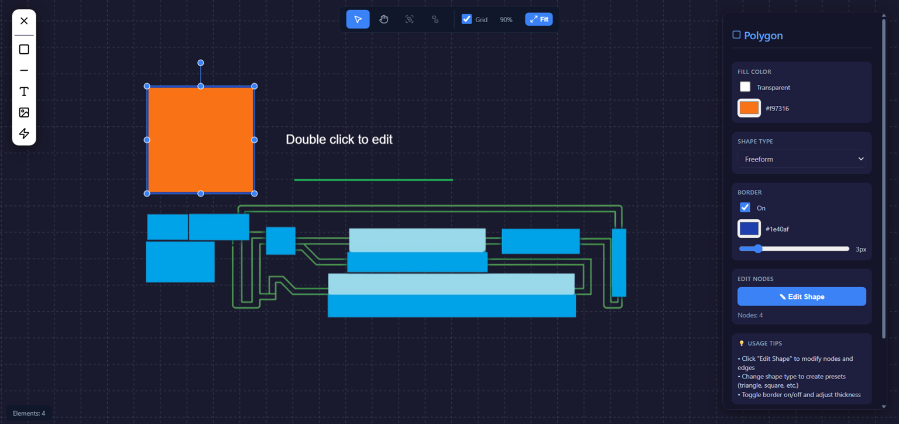

# FlowPanel Playground - Canvas Editor



🔗 **Demo Online:** [flowpanel-playground.vercel.app](https://flowpanel-playground.vercel.app)

Canvas Editor yang fleksibel untuk membuat dan mengedit desain visual dengan komponen modular. Aplikasi ini memungkinkan pengguna menambahkan berbagai elemen visual ke dalam satu canvas utama dengan kemampuan editing properti individual.

## 🛠️ Tech Stack

### Frontend Framework
- **React 19.2.0**: Modern React dengan concurrent features dan automatic batching
- **Vite 7.2.4**: Fast build tool dengan Hot Module Replacement (HMR)

### Canvas & Graphics
- **Fabric.js 7.1.0**: Powerful HTML5 canvas library untuk object manipulation
- **Custom Element System**: Class-based architecture dengan BaseElement abstract class

### State Management
- **React Hooks**: Custom `useCanvasEditor` hook untuk state management
- **UUID 13.0.0**: Unique identifier generation untuk elemen

### UI & Styling
- **Lucide React 0.561.0**: Beautiful icon library
- **CSS-in-JS**: Custom styling system dengan modular CSS files
- **Responsive Design**: Floating panels dan collapsible sidebar

### Development Tools
- **ESLint 9.39.1**: Code linting dan quality assurance
- **Vite Plugins**: React plugin untuk optimal development experience

### Architecture Patterns
- **Component Composition**: Modular React components
- **Custom Hooks**: Reusable state logic
- **Abstract Factory**: Element creation pattern
- **Observer Pattern**: Event-driven canvas interactions

## ✨ Fitur Utama

### 🎨 Elemen Visual
- **Polygon Element**: Bentuk polygon yang dapat diedit nodes-nya
- **Text Element**: Teks dengan properti font lengkap
- **Image Element**: Upload dan edit gambar
- **BezierLine Element**: Garis lengkung dengan control points
- **Multiple Instances**: Dukungan multiple instance dari setiap elemen

### 🛠️ Canvas Tools
- **Pan & Zoom**: Navigasi canvas dengan mouse wheel dan drag
- **Grid Overlay**: Toggle grid dengan spacing adaptif
- **Fit View**: Zoom otomatis untuk menampilkan semua elemen
- **Selection**: Single dan multiple selection dengan Shift+click
- **Grouping**: Group/ungroup elemen untuk manajemen yang lebih baik

### ⚙️ Properties Editing
- **Real-time Updates**: Perubahan properti langsung terlihat di canvas
- **Dynamic Properties Panel**: Panel properti yang adaptif berdasarkan tipe elemen
- **Validation**: Validasi input untuk properti tertentu

### ⌨️ Keyboard Shortcuts
- `V`: Select tool
- `H`: Pan tool
- `Delete/Backspace`: Hapus elemen yang dipilih
- `Space + Drag`: Pan canvas

## 🚀 Instalasi

### Prerequisites
- Node.js (versi 16 atau lebih baru)
- npm atau yarn

### Langkah Instalasi

1. **Clone repository**
   ```bash
   git clone https://github.com/dikigambol/flowpanel-playground.git
   cd flowpanel-playground
   ```

2. **Install dependencies**
   ```bash
   npm install
   ```

3. **Jalankan development server**
   ```bash
   npm run dev
   ```

4. **Buka browser**
   
   Aplikasi akan berjalan di `http://localhost:5173`

## 📖 Cara Penggunaan

### Menambah Elemen

1. **Buka Sidebar**: Klik tombol menu di kiri atas untuk expand sidebar
2. **Pilih Elemen**:
   - **Add Shape (Polygon)**: Klik ikon square untuk menambah polygon
   - **Add Line (BezierLine)**: Klik ikon minus untuk menambah garis lengkung
   - **Add Text**: Klik ikon Type untuk menambah teks
   - **Add Image**: Klik ikon Image untuk upload gambar dari file
   - **Add Symbol**: Klik ikon Zap untuk menambah simbol mesin (dalam development)

### Editing Elemen

1. **Select Elemen**: Klik pada elemen di canvas untuk memilihnya
2. **Multiple Selection**: Tahan Shift dan klik untuk memilih multiple elemen
3. **Edit Properties**: Gunakan panel properties di kanan untuk mengubah:
   - **Polygon**: Fill color, stroke color, stroke width, edit nodes
   - **Text**: Font family, size, color, alignment, bold/italic
   - **Image**: Scale, position, opacity
   - **BezierLine**: Control points, stroke properties

### Canvas Navigation

- **Zoom**: Gunakan mouse wheel untuk zoom in/out
- **Pan**: Tahan Space + drag, atau gunakan tool pan (H)
- **Fit View**: Klik tombol fit view untuk zoom otomatis
- **Grid Toggle**: Klik tombol grid untuk show/hide grid

### Element Management

- **Delete**: Pilih elemen dan tekan Delete, atau gunakan tombol delete di properties panel
- **Group/Ungroup**: Pilih multiple elemen dan gunakan opsi group
- **Duplicate**: Fitur duplicate dalam development

### Tools

- **Select Tool (V)**: Default tool untuk select dan edit elemen
- **Pan Tool (H)**: Tool untuk navigasi canvas tanpa select elemen

## 🏗️ Struktur Proyek

```
src/
├── components/
│   └── canvas-editor/
│       ├── CanvasEditor.jsx          # Komponen canvas utama
│       ├── CanvasEditorTest.jsx      # Komponen test
│       ├── index.js                  # Barrel export
│       ├── components/
│       │   ├── Sidebar.jsx           # Menu tambah elemen
│       │   ├── PropertiesPanel.jsx   # Panel edit properti
│       │   ├── FloatingToolbar.jsx   # Toolbar kontrol cepat
│       │   ├── PolygonProperties.jsx # Properti polygon
│       │   ├── TextProperties.jsx    # Properti text
│       │   ├── ImageProperties.jsx   # Properti image
│       │   ├── LineProperties.jsx    # Properti line
│       │   └── index.js
│       ├── elements/
│       │   ├── base-element.js       # Abstract base class
│       │   ├── polygon-element.js    # Implementasi polygon
│       │   ├── text-element.js       # Implementasi text
│       │   ├── image-element.js      # Implementasi image
│       │   ├── bezier-line-element.js # Implementasi bezier line
│       │   └── index.js
│       ├── hooks/
│       │   ├── useCanvasEditor.js    # Hook state management
│       │   └── index.js
│       └── styles/
│           ├── editor-styles.js      # Styling utama
│           ├── scrollbar.css         # Custom scrollbar
│           └── index.js
├── App.jsx                           # Komponen root
├── main.jsx                          # Entry point
└── assets/                           # Static assets
```

## 📦 Dependencies

### Core Dependencies
- **React**: ^19.2.0 - UI framework dengan concurrent features
- **Fabric.js**: ^7.1.0 - HTML5 canvas library untuk object manipulation
- **UUID**: ^13.0.0 - Unique identifier generation
- **Lucide React**: ^0.561.0 - Icon library untuk UI components

### Development Dependencies
- **Vite**: ^7.2.4 - Build tool dan development server
- **@vitejs/plugin-react**: ^5.1.1 - React plugin untuk Vite
- **ESLint**: ^9.39.1 - Code linting dan quality assurance
- **@eslint/js**: ^9.39.1 - ESLint JavaScript configuration
- **@types/react**: ^19.2.5 - TypeScript types untuk React
- **@types/react-dom**: ^19.2.3 - TypeScript types untuk React DOM
- **eslint-plugin-react-hooks**: ^7.0.1 - ESLint rules untuk React hooks
- **eslint-plugin-react-refresh**: ^0.4.24 - ESLint plugin untuk React refresh
- **globals**: ^16.5.0 - Global variables untuk ESLint

## 🔧 Scripts

```bash
# Development
npm run dev          # Jalankan development server
npm run build        # Build untuk production
npm run preview      # Preview production build
npm run lint         # Jalankan ESLint
```

## 🎯 Arsitektur

### State Management
- **useCanvasEditor Hook**: Custom hook untuk mengelola state canvas dan elemen
- **Element Array**: Array objek elemen dengan ID unik dan properties
- **Fabric.js Integration**: Sinkronisasi antara React state dan Fabric objects

### Element System
- **BaseElement**: Abstract class untuk konsistensi interface
- **Element Types**: Polygon, Text, Image, BezierLine dengan implementasi spesifik
- **Event Callbacks**: onSelect, onUpdate, onDelete untuk interaksi

### UI Components
- **CanvasEditor**: Komponen utama dengan canvas dan controls
- **Sidebar**: Menu collapsible untuk add elemen
- **PropertiesPanel**: Panel dinamis untuk edit properti
- **FloatingToolbar**: Controls cepat untuk canvas operations

### Design Patterns
- **Component Composition**: Modular React components dengan separation of concerns
- **Custom Hooks**: Reusable state logic dan business logic extraction
- **Abstract Factory**: Element creation pattern untuk different element types
- **Observer Pattern**: Event-driven architecture untuk canvas interactions
- **Strategy Pattern**: Different editing strategies untuk setiap element type

## 💡 Technology Choices

### Mengapa React?
- **Component-Based**: Modular architecture yang cocok untuk canvas editor dengan multiple element types
- **Hooks**: Modern state management tanpa class components
- **Concurrent Features**: Better performance untuk complex canvas interactions
- **Large Ecosystem**: Rich ecosystem untuk development tools dan libraries

### Mengapa Fabric.js?
- **Object Model**: Rich object model untuk canvas elements dengan built-in events
- **Serialization**: Easy save/load canvas state
- **Performance**: Optimized untuk multiple objects dan complex interactions
- **Cross-browser**: Consistent behavior across different browsers

### Mengapa Vite?
- **Fast Development**: Lightning-fast HMR dan build times
- **Modern ES Modules**: Native ES modules support
- **Plugin Ecosystem**: Rich plugins untuk React dan other tools
- **Production Ready**: Optimized builds untuk production deployment

### Mengapa Custom Hooks?
- **Reusability**: Logic extraction untuk complex canvas state management
- **Testability**: Isolated business logic yang mudah di-test
- **Separation of Concerns**: Clean separation antara UI dan business logic
- **Performance**: Optimized re-renders dengan proper dependency management

## 🚧 Status Development

### ✅ Completed Features
- Multiple element support (Polygon, Text, Image, BezierLine)
- Canvas pan/zoom dan grid
- Properties editing dengan real-time updates
- Element selection dan management
- Keyboard shortcuts
- File upload untuk images
- Group/ungroup functionality

### 🔄 In Development
- Symbol library untuk machine diagrams
- Duplicate element functionality
- Snap to grid/objects
- Undo/redo system

### 📋 Planned Features
- Persistence (save/load canvas)
- Export to image/SVG
- Templates system
- Collaboration features
- Advanced snapping dan guides

## 🤝 Contributing

1. Fork repository
2. Create feature branch (`git checkout -b feature/AmazingFeature`)
3. Commit changes (`git commit -m 'Add some AmazingFeature'`)
4. Push to branch (`git push origin feature/AmazingFeature`)
5. Open Pull Request

## 📄 Lisensi

This project is licensed under the MIT License - see the [LICENSE](LICENSE) file for details.

## 📞 Support

Jika Anda memiliki pertanyaan atau mengalami masalah, silakan buat issue di repository ini.

---

**Dikembangkan dengan ❤️ menggunakan React, Fabric.js, dan Vite**
